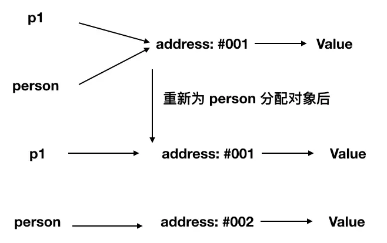

# 面试指导

## 基础面试题

### 原始类型
::: tip
js 中有六种原始类型，原始类型保存值, 引用类型保存对象的应用。
:::

### 六种原始类型
* string
* number
* boolean
* null
* undefined
* symbol

### null到底是什么类型
书中解释`null`属于空对象, 是一个对象类型。在早期的`js`版本中使用的是32位系统，考虑性能问题，使用低位存储变量的类型信息，`000`开头代表对象，而`null`代表全零，所以将它错误的判断成`object`，虽然后期内部代码已经改变，但`null`类型为`object`的判断却保留了下来，属于历史遗留问题，是`bug`也好，说它是空对象，是对象类型也能理解的通。

### 对象类型
::: tip
js中除了原始类型，其他的都属于对象类型，对象类型存储的是地址，而原始类型存储的是值。
:::

```js
var a= [];
var b = a;
a.push(2);
console.log(b); // 输出[2]
```
以上代码创建了一个对象类型`a`(数组)，再把`a`的地址赋值给了变量`b`，`b`的值也同步发生了改变，因为他们在内存中使用的是同一个地址，改变其中任何一个变量的值，都会影响到其他的变量。

#### 对象当做函数参数
```js
function person(per) {
    per.age = 10;
    per = {
        name: '李四',
        age: 18
    }
    return per;
}
var p1 = {
    name: '张三',
    age: 20
}
var p2 = person(p1);
console.log(p1.age); // 输出 10
console.log(p2.age); // 输出 18
```
**代码分析**
1. `person`函数中，`per`传递的是对象`p1`的指针副本
2. 在函数内部，改变了`per`的属性，会同步反映到对象`p1`上，`p1`对象中的`age`属性发生了改变，即值为10
3. `person`函数又返回了一个新的对象，这个对象和参数`per`没有任何关系，因为它分配了一个新的内存地址
4. 如下图所示



### typeof和instanceof

#### typeof
::: tip
`typeof`能准确判断`null`以外的原始类型的值，对于对象类型，除了函数会判断成`function`,其他对象一律返回`object`
:::

```js
typeof 1  // number
typeof '1' // string
typeof true // boolean
typeof undefined // undefined
typeof Symbol() // symbol

typeof [] // object
typeof {} // object
typeof console.log // function
```
#### instanceof
::: tip
`instanceof`通过原型链可以判断出对象的类型，但并不百分百准确
:::
```js
function Person(name) {
    this.name = name;
}
var p1 = new Preson();
console.log(p1 instanceof Person) // true

var str = new String('str');
console.log(str instanceof String); // true
```

### 类型转换
`js`中类型转换只有三种：
1. 转换成数字
2. 转换成布尔值
3. 转换成字符串

#### 经典类型面试题
```js
console.log([] == ![]); // true
```
**代码分析**
1. 左侧是一个对象（数组）
2. 右侧是一个布尔值，对象`[]`转换成布尔值是`true`，因为除了`null`所有对象都可以转换成布尔值，所以`![]`结果为`false`
3. 此时相当于`对象==布尔值`，依据类型转换规则，转换成数字类型进行比较
4. 对象（空数组）转换成`0`, 布尔值`false`转换成`0`
5. 即`0==0`, 返回`true`

类型转换规则，如下图


