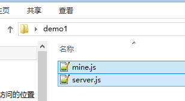
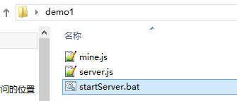
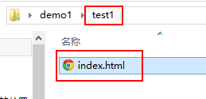
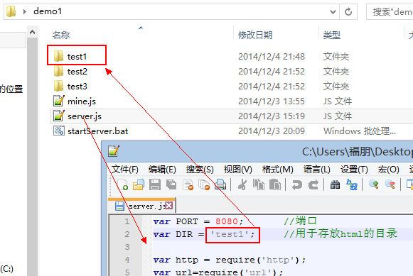
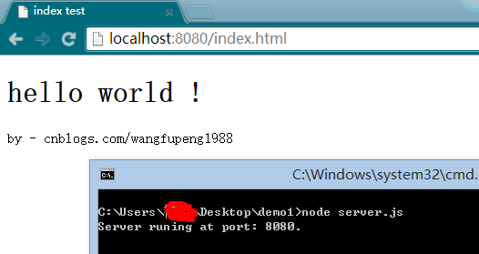

# 前端本地服务

## nodejs搭建最简单轻量server

### 第一步，安装node.js

直接到[node官网](www.nodejs.org)下载安装即可

### 第二步，创建两个js文件

* 创建两个js文件，分别保存为server.js和mine.js,代码如下
**server.js**
```js
var PORT = 8080;       //端口
var DIR = 'test1';     //用于存放html的目录

var http = require('http');
var url=require('url');
var fs=require('fs');
var mine=require('./mine').types;
var path=require('path');

var server = http.createServer(function (request, response) {
    var pathname = url.parse(request.url).pathname;
    var realPath = path.join(DIR, pathname);
    //console.log(realPath);
    var ext = path.extname(realPath);
    ext = ext ? ext.slice(1) : 'unknown';
    fs.exists(realPath, function (exists) {
        if (!exists) {
            response.writeHead(404, {
                'Content-Type': 'text/plain'
            });

            response.write("This request URL " + pathname + " was not found on this server.");
            response.end();
        } else {
            fs.readFile(realPath, "binary", function (err, file) {
                if (err) {
                    response.writeHead(500, {
                        'Content-Type': 'text/plain'
                    });
                    response.end(err);
                } else {
                    var contentType = mine[ext] || "text/plain";
                    response.writeHead(200, {
                        'Content-Type': contentType
                    });
                    response.write(file, "binary");
                    response.end();
                }
            });
        }
    });
});
server.listen(PORT);
console.log("Server runing at port: " + PORT + ".");
```
**mine.js**
```js
exports.types = {
  "css": "text/css",
  "gif": "image/gif",
  "html": "text/html",
  "ico": "image/x-icon",
  "jpeg": "image/jpeg",
  "jpg": "image/jpeg",
  "js": "text/javascript",
  "json": "application/json",
  "pdf": "application/pdf",
  "png": "image/png",
  "svg": "image/svg+xml",
  "swf": "application/x-shockwave-flash",
  "tiff": "image/tiff",
  "txt": "text/plain",
  "wav": "audio/x-wav",
  "wma": "audio/x-ms-wma",
  "wmv": "video/x-ms-wmv",
  "xml": "text/xml"
};
```

在桌面上新建一个demo1的文件夹，把这两个创建好的js文件拷进去


### 第三步，创建一个.bat命令文件
* 还是那个“demo1”文件夹，再在这个文件夹中创建一个“startServer.bat”文件，文件内容其实就一句话：
```js
node server.js
```
* 此时 demo1 文件夹中就有了三个文件：


### 第四步，加入你的html文件



:::warning
重点需要注意：为什么这里会有一个“test1”文件夹呢？因为我们的“server.js”中配置的目录就是“test1”。如果你看着不顺眼，可以改掉，但是要保证两者名称一致。
:::

* 如果我们在demo1中有好几个测试项目，需要运行哪一个，可以打开“server.js”修改配置即可，非常方便。



### 一键启动

> 如何“一键”启动？ 大家应该都能猜到了——startServer.bat——对，双击运行startServer.bat，控制台即提示你有http server服务了

`端口号默认是“8080”，可以在“server.js”中修改，就在代码第一行。`



### 创建多个http server

:::tip
咱们上面说了半天，就讲了如何创建第一个http server，其实创建第二个、第三个、第四个……都一样简单。

把 demo1 文件夹中的三个文件，考到你想要创建站点的位置。打开 server.js 修改一下端口号和目录名称，运行startServer.bat就可以了。
:::

**想在那里创建http server，就拷贝到哪里，然后运行。不想再用http server了，直接删掉那三个文件就行**

